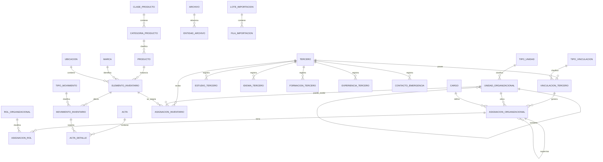

# Modelo de datos general

## 1. Dominios

El modelo se divide en cuatro dominios principales:

1. Organización.
2. Terceros y talento.
3. Inventarios.
4. Plataforma transversal: auditoría, documentos, catálogos e importación.

## 2. Relaciones de alto nivel

## 3. Criterios de normalización

### No duplicar datos de organización en asignaciones de inventario

La hoja `Asignaciones` contiene nombre del tercero, área, subdirección, rol y correo. En el modelo final deben persistirse las llaves del elemento, la persona o asignación organizacional y el movimiento. Las descripciones se consultan mediante relaciones o se conservan únicamente como instantánea documental cuando sea necesario.

### Datos calculados o de presentación

No deben ser la fuente principal:

- Nombre completo del tercero.
- Resumen del elemento.
- Nombre del área junto al código.
- Subdirección derivada de la jerarquía.
- Nivel organizacional, salvo que se decida persistirlo como optimización controlada.

### Instantáneas históricas

Las actas sí pueden conservar una instantánea de nombre, documento, cargo, unidad y descripción del elemento en el momento de emisión. Esta instantánea no reemplaza las relaciones normalizadas; sirve para que el documento histórico no cambie si posteriormente se actualizan los maestros.

## 4. Llaves de negocio relevantes

- `unidad_organizacional.codigo` debe ser único por vigencia o globalmente, según la decisión final.
- `tercero + tipo_documento + numero_documento` debe evitar duplicados.
- `producto.codigo` debe ser único.
- Seriales o placas de inventario deben ser únicos cuando existan y aplique.
- Número de acta debe ser único dentro de su tipo o serie documental.
- Una asignación de inventario activa por elemento como máximo.

## 5. Catálogos transversales sugeridos

- Países, departamentos y municipios.
- Tipos de documento.
- Estados de validación.
- Tipos de archivo o soporte.
- Tipos de vinculación.
- Modalidades de trabajo.
- Sedes y ubicaciones.
- Centros de costo.
- Financiadores.
- Monedas.
- Estados de conservación.
- Estados operativos de inventario.
- Motivos de baja, pérdida, devolución y traslado.

Codex debe reutilizar catálogos existentes en el repositorio y evitar crear duplicados semánticos.
