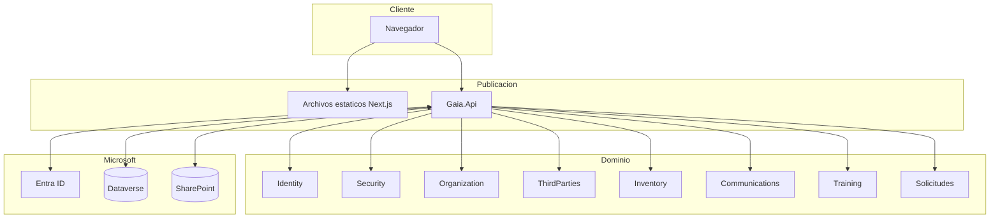
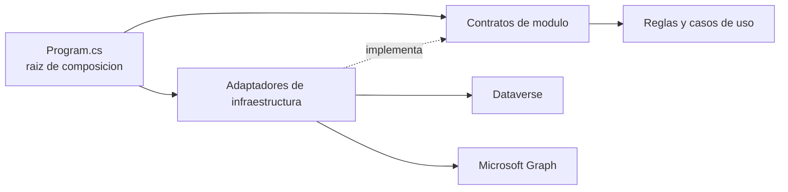

# Visión, alcance y arquitectura

> Estado: **vigente** · Verificado: **2026-10-09**
> Evidencia principal: `Gaia.Platform.slnx`, `global.json`, `Directory.Build.props`, `src/Gaia.Api/Program.cs`, `apps/web/package.json`, `apps/web/next.config.ts`.

## Propósito del producto

Gaia integra una intranet institucional y un entorno administrativo denominado AdminCore. Centraliza contenido, estructura organizacional, talento humano, inventario, capacitaciones, solicitudes, seguridad y configuración, reutilizando Microsoft 365 y Dataverse como plataforma empresarial.

## Alcance implementado

- experiencia de Intranet para colaboradores;
- experiencia AdminCore para gestión operativa y funcional;
- autenticación corporativa mediante Microsoft Entra ID;
- autorización por roles y permisos propios de Gaia;
- persistencia mediante Dataverse Web API;
- archivos en SharePoint Online mediante Microsoft Graph;
- módulos backend con contratos, reglas y endpoints aislados;
- frontend responsive con rutas y componentes compartidos;
- pruebas backend con xUnit y frontend con Vitest, TypeScript y ESLint.

## Topología

## Procesos desplegables

| Proceso | Ubicación | Tecnología | Responsabilidad |
|---|---|---|---|
| Frontend | `apps/web` | Next.js 16, React 19, TypeScript 5, Tailwind CSS 4 | Presentación, navegación, captura y consumo de la API |
| API | `src/Gaia.Api` | ASP.NET Core, .NET 10 | Sesión, autorización, reglas, composición e integraciones |

`apps/web/next.config.ts` usa `output: "export"`. El resultado es una aplicación estática: no hay Server Actions ni rutas API de Next como backend alterno. Toda operación empresarial pasa por Gaia.Api.

## Monolito modular

La solución no es un conjunto de microservicios. `Gaia.Platform.slnx` compone una sola API con proyectos de módulo separados:

- `src/Modules/<Modulo>`: contratos, reglas y endpoints del dominio;
- `src/BuildingBlocks`: capacidades transversales reutilizables;
- `src/Gaia.Api`: raíz de composición, middleware y adaptadores concretos;
- `tests`: pruebas de reglas, endpoints e infraestructura.

Los módulos no deben depender de adaptadores concretos de Dataverse o Graph. La API registra las implementaciones y mantiene las dependencias orientadas hacia contratos.

## Composición de la API

`Program.cs` registra adaptadores y módulos, CORS, autenticación, autorización, manejo de errores, encabezados de seguridad, trazabilidad y endpoints de salud. OpenAPI se publica solo en desarrollo. La configuración modular se realiza en la raíz; la lógica funcional no debe acumularse en `Program.cs`.

## Decisiones de frontera

- La UI puede ocultar acciones por permiso para mejorar la experiencia, pero la API es la autoridad de autorización.
- Fechas límite, estados, transiciones, resultados y reglas de negocio se calculan o validan en backend.
- Los cambios en maestros no reescriben silenciosamente el historial de solicitudes, asignaciones o resultados.
- Los archivos se referencian mediante metadatos controlados; identificadores internos de SharePoint no se exponen como contrato público.
- Una funcionalidad pendiente no justifica crear una base paralela ni persistencia temporal fuera de Dataverse.

## Convenciones de implementación

### Backend

- Namespaces de dominio: `Gaia.Modules.<Modulo>`; adaptadores: `Gaia.Api.Infrastructure.Dataverse.<Modulo>`.
- DTO inmutables preferiblemente como `record`; `Guid` para IDs, `DateOnly` para fecha civil y `DateTimeOffset` para instantes.
- La nulabilidad expresa ausencia; no se usa nulo como sinónimo de activo.
- I/O es asíncrona, cancelable y sin `.Result`/`.Wait()`.
- Interfaces se inyectan por constructor y las implementaciones se registran scoped siguiendo el módulo cercano.
- Reglas puras validan invariantes; endpoints traducen a HTTP; adaptadores traducen Dataverse a contratos.
- No se imponen CQRS, MediatR, repositorios genéricos u ORM por uniformidad: no forman parte de la arquitectura actual.

### Frontend

- Componentes y tipos en PascalCase; variables/funciones en camelCase; evitar `any`.
- `"use client"` únicamente donde existen hooks, eventos o APIs del navegador.
- Reutilizar `apiRequest<T>`, seguridad, feedback y componentes existentes.
- El estado local controla selección, filtros y paginación; las reglas empresariales permanecen en API.
- Búsquedas usan debounce/cancelación o ignoran respuestas obsoletas.
- Después de mutar se reconcilia el dato afectado; no se anuncia éxito antes de la respuesta.
- Claves de listas son IDs estables, no índices mutables.

### Dataverse/OData

1. Obtener el cliente delegado del usuario.
2. Resolver `EntitySetName`, clave primaria, atributos y relaciones mediante metadata.
3. Limitar `$select`, escapar filtros y validar parámetros.
4. Usar lookups y `@odata.bind` según la navegación publicada.
5. Seguir `@odata.nextLink`; no usar `$skip`.
6. No enviar campos desconocidos o nulos innecesarios.
7. Usar lectura completa solo cuando el volumen y el caso lo justifican.

Los campos históricos pueden ser texto aunque su significado parezca choice; el tipo publicado prevalece sobre inferencias.

## Fechas y zona horaria

Metadatos técnicos usan instantes; reglas de fecha civil no deben depender accidentalmente de la zona del navegador. La API calcula el día institucional con la zona de Bogotá cuando corresponde. Todo filtro temporal debe probar medianoche, fin de mes/año, vigencia y días no laborables.

## Versiones verificadas

| Componente | Versión observada |
|---|---:|
| SDK .NET | `10.0.301` en `global.json` |
| Target Framework | `net10.0` |
| Next.js | `16.2.12` |
| React | `19.2.4` |
| TypeScript | `5.x` |
| Tailwind CSS | `4.x` |
| Vitest | `4.1.10` |

Las versiones son una fotografía del repositorio; deben releerse desde los manifiestos antes de una actualización.

## Restricciones para cambios futuros

- No dividir módulos en servicios independientes sin ADR, estrategia de datos y operación aprobadas.
- No permitir acceso directo del navegador a Dataverse o Graph.
- No introducir un segundo sistema de autenticación o autorización.
- No inventar nombres lógicos de Dataverse: consultar metadatos y solución administrada.
- No reemplazar el sistema visual ni el cliente HTTP sin demostrar necesidad y plan de migración.
- No declarar un ambiente listo para producción basándose únicamente en una compilación local.
