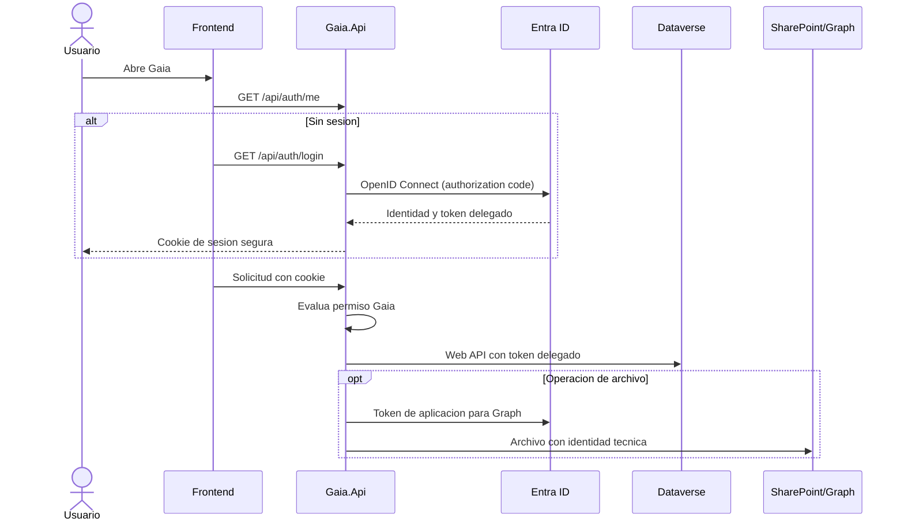
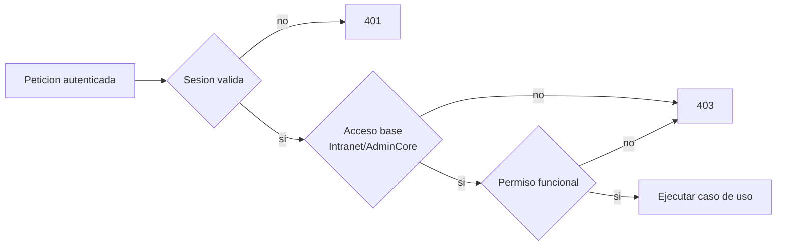

# Identidad, autorización e integraciones Microsoft

> Estado: **vigente** · Verificado: **2026-10-09**
> Evidencia principal: `IdentityModule.cs`, `IdentityEndpoints.cs`, `SecurityModule.cs`, `SecurityContracts.cs`, `SecurityEndpoints.cs`, `apps/web/src/lib/route-access.ts` e infraestructura de archivos.

## Modelo de confianza

Gaia usa identidades distintas porque autenticación humana, acceso delegado a Dataverse y almacenamiento técnico de archivos tienen propósitos y riesgos diferentes.



## Inicio de sesión

La API usa OpenID Connect con Microsoft Identity Web y una cookie propia:

- esquema predeterminado: cookie;
- desafío: OpenID Connect;
- flujo: authorization code;
- token cache: en memoria en la configuración actual;
- `SaveTokens`: desactivado;
- cookie: `__Host-Gaia.Session`, `HttpOnly`, `Secure` y vigencia deslizante de ocho horas;
- endpoints: `GET /api/auth/login`, `GET /api/auth/logout`, `GET /api/auth/me`.

Los endpoints API devuelven `401` o `403`; no redirigen implícitamente a HTML. El retorno después del login se valida contra el origen configurado del frontend para evitar redirecciones abiertas.

El frontend controla actualmente una inactividad de 40 minutos y sincroniza actividad entre pestañas. Es una medida de experiencia, no una expiración impuesta por servidor. La transición visual posterior al login añade aproximadamente 300 ms. Reiniciar una instancia puede perder la caché de tokens aunque la cookie continúe; el cliente debe tratar `reauth_required` como necesidad de autenticarse nuevamente.

## Autorización funcional

Los usuarios, roles, permisos, módulos y asignaciones de Gaia se persisten en Dataverse. Las políticas se construyen desde el catálogo de `SecurityContracts.cs` y se aplican a endpoints mediante `RequireAuthorization`.

Familias observadas de permiso:

- `INTRANET` e `INT`: acceso a Intranet y AdminCore;
- `HD`: Solicitudes;
- `CAP`: Capacitaciones;
- `ORG`: Organización;
- `TH`: Talento Humano y terceros;
- `INV`: Inventarios;
- `COM`: Comunicaciones;
- `CONFIG`: configuración transversal;
- `TI`: seguridad y administración técnica.

El acceso visual de una ruta se filtra también en `apps/web/src/lib/route-access.ts`, pero este filtro no sustituye la política del endpoint. Una URL, un botón oculto o una petición manual nunca deben eludir el backend.



Existe un mecanismo de administradores iniciales configurados para recuperar o constituir el acceso. Debe tratarse como bootstrap controlado, no como sustituto permanente de roles y permisos.

### Alcance organizacional y administración global

El rol puede contener la propiedad booleana `gaia_administracionglobal`. Debe ser obligatoria, predeterminada en No y marcada explícitamente en Sí solo para roles realmente globales. El nombre “Administrador” no concede alcance por sí mismo.

En Servicios y flujos, el permiso funcional decide qué acción puede ejecutarse y esta propiedad decide si el alcance supera las unidades vigentes del usuario. Los roles departamentales no ven ni administran servicios de otras unidades. La API cruza usuario, asignaciones de rol vigentes, tercero, asignaciones organizacionales vigentes y unidad propietaria del recurso; fuera de alcance responde `403`.

## Dataverse

- La API obtiene un token **delegado del usuario** para el scope de Dataverse.
- Dataverse vuelve a evaluar los privilegios de esa identidad.
- Gaia aplica además su autorización funcional antes de invocar el adaptador.
- El frontend nunca recibe ni almacena el token de Dataverse.

Esto produce defensa en profundidad: permiso Gaia y privilegio efectivo de Dataverse deben permitir la operación.

## SharePoint y Microsoft Graph

Los archivos usan una identidad técnica del backend. La recomendación operativa es una aplicación con el mínimo privilegio posible, preferiblemente `Sites.Selected`, autorizada únicamente sobre el sitio requerido.

La configuración de SharePoint puede obtenerse desde la tabla de configuración prevista en Dataverse y es validada por el backend. Los identificadores de sitio, unidad y elemento son internos; no deben incorporarse a URLs públicas ni enviarse como credenciales al cliente.

La información necesaria antes del login —por ejemplo, una configuración pública de acceso— no puede depender de un token delegado inexistente. Debe publicarse mediante el mecanismo de instantánea/configuración pública previsto, con datos no sensibles.

## Encabezados, CORS y errores

La API compone CORS para el origen configurado, encabezados de seguridad, trazabilidad y un mapeo controlado de excepciones. La configuración debe conservar:

- orígenes explícitos, nunca comodines con credenciales;
- cookies seguras y de alcance host;
- respuestas `ProblemDetails` o equivalentes sin trazas ni secretos;
- correlación suficiente para investigar errores sin registrar tokens o cargas sensibles.

## Secretos y configuración segura

Nunca se almacenan en Git o Markdown:

- secretos de cliente, contraseñas o tokens;
- `appsettings.Development.json` real;
- `.env.local` real;
- exportaciones con datos personales;
- identificadores o permisos copiados sin necesidad operativa.

En desarrollo, el secreto de Entra se registra con .NET User Secrets. En ambientes alojados debe usarse un almacén de secretos administrado y rotación formal.

## Configurar Microsoft Entra ID en un entorno nuevo

Los nombres exactos del portal pueden cambiar; los valores funcionales que Gaia necesita son estables. Esta guía distingue lo verificado en código de lo que el administrador debe confirmar en el tenant.

1. En **Microsoft Entra admin center → Identity → Applications → App registrations**, crear o seleccionar el registro usado por Gaia.Api.
2. Registrar la plataforma **Web**, no SPA, porque el callback y la cookie los administra el backend.
3. Añadir las URI de redirección HTTPS de la API, por ejemplo `https://gaia-api.example.org/signin-oidc` y la URI local `https://localhost:7168/signin-oidc` solo para desarrollo autorizado.
4. Registrar la URI posterior al cierre con `/signout-callback-oidc` cuando la política del tenant lo requiera.
5. En **API permissions**, agregar el permiso delegado requerido por el entorno Dataverse (`user_impersonation`) y conceder consentimiento según la política institucional.
6. Crear el mecanismo de credencial para el backend: certificado en ambientes alojados cuando esté disponible; secreto de cliente únicamente con almacenamiento y rotación administrados.
7. Entregar al responsable de Gaia solamente `TenantId`, `ClientId`, alcance Dataverse y referencia segura de la credencial. El valor secreto no se documenta.
8. Configurar `MicrosoftEntra`, `Dataverse` y `WebApplication:BaseUrl` en el proveedor de configuración del ambiente.
9. Registrar el secreto local con User Secrets; en producción usar el almacén aprobado.
10. Confirmar que el origen del frontend y las URI registradas coinciden exactamente en esquema, host, puerto y ruta.
11. Probar `/api/auth/login`, completar el callback y verificar `/api/auth/me`.
12. Probar una consulta Dataverse autorizada y otra con un usuario sin privilegios para distinguir autenticación de autorización.

Valores de ejemplo:

```json
{
  "MicrosoftEntra": {
    "Instance": "https://login.microsoftonline.com/",
    "TenantId": "00000000-0000-0000-0000-000000000000",
    "ClientId": "11111111-1111-1111-1111-111111111111",
    "CallbackPath": "/signin-oidc",
    "SignedOutCallbackPath": "/signout-callback-oidc"
  },
  "Dataverse": {
    "EnvironmentUrl": "https://example.crm.dynamics.com",
    "WebApiEndpoint": "https://example.api.crm.dynamics.com/api/data/v9.2",
    "Scope": "https://example.crm.dynamics.com/user_impersonation"
  },
  "WebApplication": {
    "BaseUrl": "https://gaia.example.org"
  }
}
```

Pendiente por ambiente: confirmar política de consentimiento, tipo de credencial permitido, dominios, URI de producción y privilegios Dataverse. Esos valores no pueden deducirse del repositorio.

## Configurar SharePoint y Graph en un entorno nuevo

1. Definir el sitio y la biblioteca que almacenarán los archivos de Gaia, junto con responsables, retención y clasificación.
2. Crear o seleccionar un registro de aplicación técnico distinto del login de usuario.
3. En Microsoft Graph, solicitar preferiblemente el permiso de aplicación `Sites.Selected` y obtener consentimiento administrativo.
4. Conceder a esa aplicación acceso únicamente al sitio elegido, con el nivel mínimo necesario para las operaciones de Gaia.
5. Obtener de forma administrativa el identificador exacto del sitio y validar la biblioteca/unidad; no exponerlos al navegador.
6. Configurar una credencial de aplicación o identidad administrada. En ambientes alojados se prefiere certificado o identidad administrada sobre secreto.
7. Registrar la configuración no secreta en la tabla configurada (`gaia_configuracionsharepoint` según el ejemplo actual) y el alias de credencial en el proveedor seguro del backend.
8. Limitar `AllowedSiteIds` y `AllowedTransferHosts` al destino real.
9. Revisar extensiones, MIME, tamaño máximo, umbral de carga simple, tamaño de fragmento y requisito de análisis.
10. Ejecutar el diagnóstico protegido de archivos y una prueba controlada de carga, lectura y eliminación lógica.
11. Verificar desde el módulo consumidor que el registro de Dataverse y el archivo quedan asociados.

La existencia y estructura exacta de la tabla, sitio y biblioteca deben confirmarse con el ambiente. El repositorio solo aporta el contrato del adaptador y ejemplos ficticios.

## Diagnóstico frecuente

| Síntoma | Verificación prioritaria |
|---|---|
| Bucle de login o callback rechazado | URI exacta, certificado HTTPS local, `BaseUrl`, cookie y hora del sistema |
| `401` después del callback | sesión/cookie, estado OIDC y configuración de claves; no confundir con permisos |
| `403` en una función | acceso base, permiso Gaia, vigencia del rol y alcance organizacional |
| Dataverse devuelve acceso denegado | privilegio/rol Dataverse de la identidad delegada y scope solicitado |
| Consentimiento requerido | permiso delegado y política de consentimiento del tenant |
| Graph devuelve `403` | consentimiento de aplicación y asignación `Sites.Selected` sobre el sitio exacto |
| Archivo no aparece | asociación en Dataverse, biblioteca/configuración activa y resultado de la carga |
| Carga grande falla | límites coordinados de API, proxy, Graph, SharePoint y configuración Gaia |
| Configuración pública no carga antes del login | instantánea/publicación anónima; no intentar usar token delegado |

Los diagnósticos deben registrar correlación y categoría del fallo, nunca tokens, secretos o cuerpos completos sensibles.

## Cachés y revocación

La seguridad funcional dispone de caché servidor. Cambiar roles o permisos exige usar el mecanismo de invalidación existente; una respuesta antigua no puede convertirse en autorización permanente. Toda caché de datos privados debe contemplar identidad, expiración, logout, revocación y fallos `401/403`.

## Lista de verificación de seguridad

- [ ] El endpoint tiene autenticación y política funcional explícita.
- [ ] La UI no es la única barrera de acceso.
- [ ] No se imprime el token ni la respuesta completa de identidad.
- [ ] El `returnUrl` se restringe al origen permitido.
- [ ] Las cargas validan tipo, tamaño, nombre y autorización.
- [ ] La identidad Graph solo accede al sitio requerido.
- [ ] Los errores no revelan rutas, secretos ni identificadores internos.
- [ ] Se prueban al menos los casos `401`, `403` y operación autorizada.
