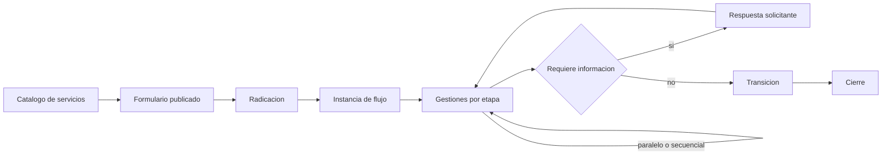
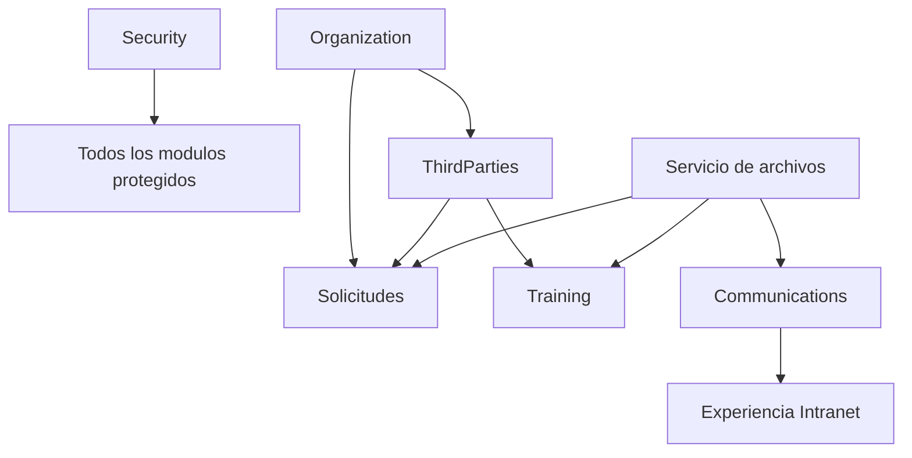

# Módulos funcionales

> Estado: **vigente** · Verificado: **2026-10-09**
> Evidencia principal: proyectos bajo `src/Modules`, registro en `src/Gaia.Api/Program.cs` y rutas bajo `apps/web/src/app`.

## Mapa de capacidades

| Módulo | Propósito | Superficies principales | Prefijo API observado |
|---|---|---|---|
| Identity | Sesión e identidad actual | Login, logout, usuario actual | `/api/auth` |
| Security | Usuarios Gaia, roles, permisos y módulos | AdminCore Seguridad | `/api/security` |
| Organization | Estructura, tipos y unidades organizacionales | AdminCore Organización | `/api/organization` y apoyo `/api/dataverse/organization` |
| ThirdParties | Colaboradores, directorio, datos de contacto y asignaciones | Talento Humano e Intranet | `/api/third-parties` e Intranet relacionada |
| Inventory | Modelo de inventario pendiente de adaptador | No disponible operativamente | `/api/inventory` responde `503` |
| Communications | Eventos, destacados, login y ambientación visual | Intranet y AdminCore Comunicaciones | `/api/communications`, `/api/intranet`, `/api/public` |
| Training | Catálogo, contenido, asignaciones, evaluaciones y resultados | Intranet y AdminCore Capacitaciones | `/api/training` |
| Solicitudes | Servicios, formularios, flujos, radicación y gestión | Intranet y AdminCore Solicitudes | `/api/solicitudes` |

Los prefijos son familias para orientación. El contrato exacto se verifica en los archivos `*Endpoints.cs` y `*Module.cs` del módulo.

## Identity

Ofrece el límite de autenticación de Gaia. Expone inicio y cierre de sesión y el contexto del usuario actual. No administra el catálogo funcional de roles; esa responsabilidad pertenece a Security.

## Security

Administra:

- usuarios provisionados en Gaia;
- roles activos;
- catálogo de permisos agrupado por módulo;
- asignaciones de rol con vigencia;
- administración global y acceso base a superficies.

La autorización negativa es parte del contrato: un usuario autenticado sin permiso recibe `403`. La elevación administrativa no debe derivarse del nombre visible del rol; se evalúan las propiedades y permisos persistidos.

## Organization

Modela la estructura organizacional y sirve de referencia para asignaciones, responsables, visibilidad y bandejas. Los nombres lógicos, choices y relaciones dependen de metadatos de Dataverse; no se duplican como tablas locales.

Las importaciones deben dividirse en validación y ejecución. Toda ejecución debe ser idempotente o detectar con claridad duplicados, referencias faltantes y jerarquías inválidas.

Detalle: [Organización, terceros y perfiles](modulos/organizacion-terceros.md).

## ThirdParties

Concentra la información de personas/colaboradores utilizada por directorio, perfil y asignaciones organizacionales. Incluye contactos y operaciones administrativas. Algunas rutas heredadas devuelven funcionalidad no disponible deliberadamente; su presencia no equivale a capacidad implementada.

La fotografía de perfil se resuelve con integración autorizada y fallback visual. Los datos personales requieren minimización, permiso funcional y trazabilidad.

Detalle: [Organización, terceros y perfiles](modulos/organizacion-terceros.md).

## Inventory

El proyecto registra el módulo y sus permisos, pero sus endpoints responden actualmente `503`: todavía no existe implementación Dataverse operativa. No debe mostrarse como capacidad terminada ni resolverse con persistencia independiente.

Modelo funcional pendiente: [Inventario](modulos/inventario.md).

## Communications

Incluye:

- tipos de evento y eventos;
- destacados/banners y sus estados;
- imágenes por variante;
- configuración visual del acceso;
- ambientaciones visuales;
- lectura de contenido de Intranet;
- una superficie pública limitada para la configuración previa al login.

Las operaciones administrativas requieren permisos `COM`; la lectura en Intranet exige acceso a la Intranet y, cuando corresponde, permisos específicos de calendario o inicio. Solo los endpoints expresamente anónimos bajo `/api/public` pueden consumirse antes de autenticar.

Detalle: [Comunicaciones y experiencia institucional](modulos/comunicaciones.md).

## Training

Separa administración y participación:

- catálogo, categorías y versiones;
- recursos asociados a versiones;
- asignaciones a participantes;
- evaluaciones, intentos y calificación;
- revisiones pendientes, resultados y exportación.

El participante solo debe acceder a sus asignaciones y recursos autorizados. Publicar una versión convierte su contenido en referencia operativa; los cambios posteriores requieren respetar resultados históricos.

Detalle: [Capacitaciones](modulos/capacitaciones.md).

## Solicitudes

Es el módulo con mayor ciclo de vida funcional:

Capacidades implementadas observadas:

- catálogo y formulario para el portal;
- creación y consulta de solicitudes;
- comentarios, adjuntos y respuesta a observaciones;
- bandejas operativas y toma/reasignación de gestión;
- formularios de etapa y respuestas de gestión;
- finalización, reapertura y reanudación;
- administración de servicios, formularios, campos, flujos, etapas y rutas;
- publicación/despublicación y exportación administrativa;
- eliminación controlada de datos de prueba con permiso específico.

Las bandejas deben aplicar alcance organizacional: “Mis pendientes” reúne lo asignado a la persona y lo disponible sin responsable en **su propia unidad organizacional**, no en unidades ajenas. Los estados visibles deben usar lenguaje funcional coherente; una solicitud finalizada se presenta como cerrada en la bandeja correspondiente aunque existan códigos internos históricos.

Los formularios de servicio y de etapa son dinámicos. Un campo conserva código interno, etiqueta, tipo, presentación, visibilidad, obligatoriedad, ancho y orden administrado. Los códigos técnicos se generan internamente; el usuario administrador no debe memorizarlos ni digitarlos.

Detalle: [Solicitudes](modulos/solicitudes.md).

## Dependencias funcionales

Las flechas expresan consumo funcional, no referencias de infraestructura permitidas entre proyectos. Las dependencias de código deben pasar por contratos y la raíz de composición.

## Documentación funcional

Los capítulos bajo `docs/modulos/` son la única ampliación oficial de este mapa. Cada uno distingue estado implementado, reglas conservadas y pendientes ambientales o funcionales.
