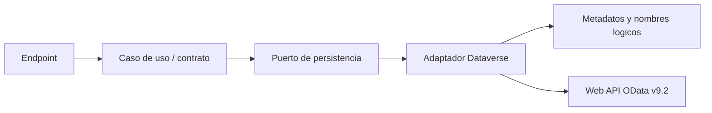
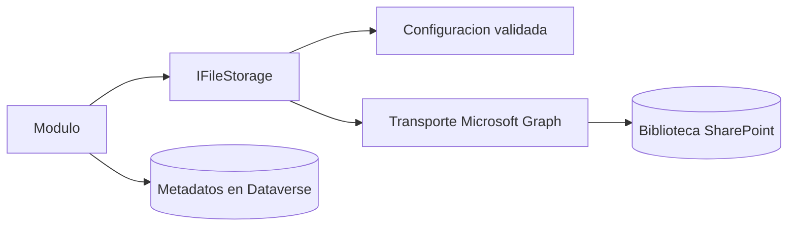
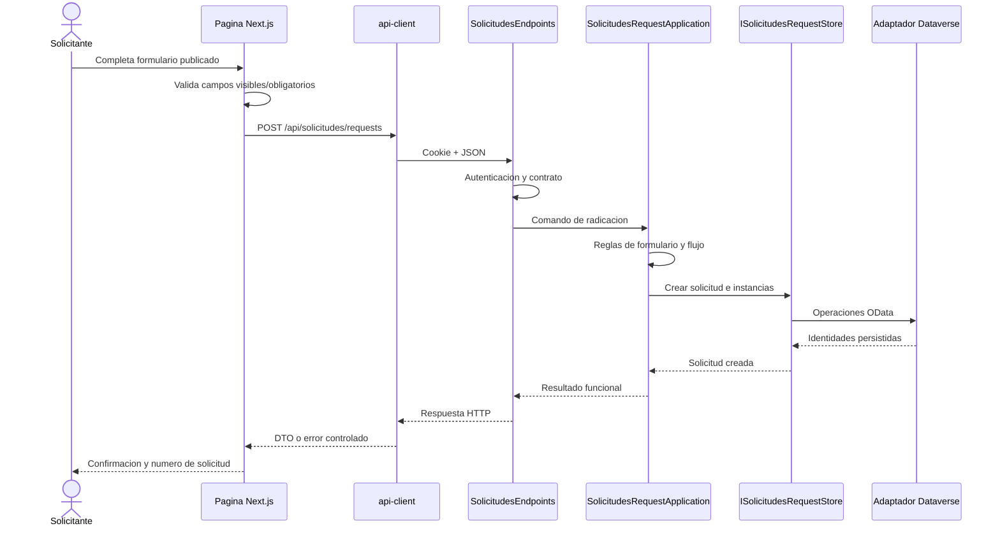

# API, persistencia y archivos

> Estado: **vigente** · Verificado: **2026-10-09**
> Evidencia principal: endpoints de módulos, `src/Gaia.Api/Infrastructure/Dataverse`, `src/Gaia.Api/Infrastructure/Files` y `apps/web/src/lib/api-client.ts`.

## Contrato HTTP

El frontend llama a Gaia.Api con `credentials: include`. El cliente agrega JSON cuando corresponde, conserva `FormData` para cargas y traduce errores de API a mensajes controlados. Una respuesta `401` inicia el flujo de reautenticación; `403` representa falta de autorización, no ausencia de sesión.

Convenciones:

- JSON para comandos y consultas estructurados;
- `multipart/form-data` para cargas;
- GUID en rutas para identidades persistidas;
- `ProblemDetails`/errores de validación para fallos esperados;
- `CancellationToken` en operaciones de red y persistencia;
- endpoints protegidos por política, no solo por autenticación genérica.

## Familias de API

| Familia | Audiencia | Uso |
|---|---|---|
| `/api/auth` | autenticada/anónima controlada | sesión y usuario actual |
| `/api/security` | AdminCore | roles, permisos y usuarios |
| `/api/organization` | AdminCore | estructura organizacional |
| `/api/third-parties` | AdminCore/Intranet según ruta | colaboradores y asignaciones |
| `/api/inventory` | AdminCore | inventarios |
| `/api/communications` | AdminCore | administración de contenido |
| `/api/intranet` | Intranet | contenido institucional |
| `/api/public` | anónima y limitada | configuración no sensible previa al login |
| `/api/training` | Intranet/AdminCore | capacitación |
| `/api/solicitudes` | Intranet/AdminCore | solicitudes y flujos |
| `/api/dataverse` | diagnóstico/administración protegida | estado, metadatos e importación |
| `/api/infrastructure/files/diagnostics` | diagnóstico protegido | validación del almacenamiento |

OpenAPI solo se habilita en desarrollo. La lista anterior no reemplaza el contrato del código ni implica que todos los métodos sean accesibles con el mismo permiso.

## Persistencia en Dataverse

Los adaptadores consumen Microsoft Dataverse Web API v9.2 mediante OData. El repositorio no usa PostgreSQL ni Entity Framework como persistencia operativa actual.

Reglas:

- consultar metadatos antes de añadir o cambiar columnas;
- respetar nombres lógicos, tipos, choices, relaciones y prefijos;
- asociar nuevos componentes a la solución Dataverse acordada;
- no convertir nombres visibles en nombres lógicos por inferencia;
- usar control de concurrencia cuando una sobrescritura pueda perder cambios;
- conservar snapshots necesarios para historia y auditoría;
- separar validación y ejecución en cargas masivas.

## Modelo por agregados, no por tabla genérica

Cada módulo define contratos propios, aunque comparta el transporte OData. En Solicitudes, por ejemplo, existen conceptos separados para servicios, formularios, campos, flujos, etapas, rutas, solicitudes, gestiones, respuestas, comentarios, adjuntos e historial. No deben colapsarse en un objeto genérico en la UI ni manipularse como diccionarios sin validación de dominio.

Los nombres de tablas observados en adaptadores son evidencia de implementación, pero no constituyen una especificación completa del ambiente. La fuente final para un despliegue es la solución y los metadatos del Dataverse de destino.

## Archivos

`IFileStorage` abstrae la carga, descarga y eliminación lógica. La implementación productiva usa SharePoint/Graph; existen componentes de desarrollo, configuración, diagnóstico, migración y validación.

Principios:

- el archivo binario y el registro empresarial tienen responsabilidades distintas;
- la asociación se completa mediante identificadores internos controlados;
- no se duplica un cargador por módulo: Solicitudes, Training y Communications reutilizan la infraestructura;
- visibilidad y obligatoriedad pertenecen a la configuración funcional del formulario cuando aplica;
- los metadatos deben permitir reconciliar registros con archivos sin exponer rutas técnicas al navegador;
- una eliminación debe comprobar autorización, dependencias y política de auditoría.

### Contratos y responsabilidades

`StoredFile.Id` contiene proveedor, repositorio (`siteId`), contenedor (`driveId`) y archivo (`driveItemId`). El resultado también conserva ETag, nombre original/técnico, MIME, longitud y, opcionalmente, URL/ruta informativas. URL y ruta nunca sustituyen los IDs estables.

`IFileStorage` cubre carga, descarga, metadata, carpeta y disponibilidad. `IFileStorageMaintenance` separa eliminación física y exige ID externo, ETag y motivo. `IFileStorageMigration` copia y verifica entre repositorios. Separar interfaces no concede autorización: el módulo valida usuario, recurso y alcance antes de invocarlas.

La carga:

- valida segmentos, extensión, MIME declarado y tamaño;
- usa nombre técnico GUID con conflicto `fail`;
- hace spool temporal `DeleteOnClose` para medir, escanear y reintentar sin cargar todo en memoria;
- usa fragmentos acotados y respeta `Retry-After` para fallos transitorios;
- no reintenta automáticamente `401`, `403`, `404` ni errores de validación;
- devuelve metadata válida antes de anunciar éxito.

`IFileContentScanner` es un punto de extensión, no un antivirus. Si `RequireContentScan=true`, la ausencia o indisponibilidad del scanner bloquea la carga. Una allowlist de MIME/extensión no prueba el contenido real.

### Configuración

La fila de `gaia_configuracionsharepoint` elige ambiente, proveedor, sitio, biblioteca, carpeta raíz, estado operativo y un alias de credencial. El alias solo referencia un perfil seguro `FileStorage:Credentials:<alias>`; nunca contiene secreto o ruta de certificado.

El servidor limita además:

- `AllowedSiteIds` y `AllowedTransferHosts` exactos;
- tamaño máximo, umbral simple y fragmento múltiplo de 320 KiB;
- extensiones y MIME explícitos;
- método Managed Identity, certificado o secreto solo en desarrollo;
- ambiente esperado y un único repositorio predeterminado.

Estados operativos observados: Borrador, Disponible, Solo lectura, En migración y Retirado. Nuevas cargas exigen Disponible; lectura permite Disponible/Solo lectura; diagnóstico puede usar Borrador. Cero o múltiples coincidencias fallan de forma cerrada. Una configuración no puede redirigir una credencial hacia un sitio o host no autorizado en el perfil servidor.

### Diagnóstico protegido

`GET /api/infrastructure/files/diagnostics` exige sesión, acceso AdminCore y permiso técnico de administración. Informa configuración, autenticación, repositorio, contenedor, raíz, lectura y estado de escritura sin exponer IDs, URLs de transferencia o respuestas Graph.

HTTP 200 significa que se generó un informe, no que todo esté disponible. La comprobación normal es de solo lectura. La prueba de escritura protegida se habilita explícitamente, crea un archivo técnico, lo verifica y elimina con ETag; nunca queda activa en producción por defecto.

### Migración de repositorio

Cambiar `siteId/driveId` no mueve archivos existentes. La migración copia desde la referencia histórica, verifica ETag, longitud y SHA-256, guarda primero la nueva referencia y conserva el origen hasta confirmar el corte. Un lote futuro debe bloquear concurrencia por registro, ser reanudable, conciliar resultados y retirar el origen solo mediante autorización. Los IDs externos no son globales entre repositorios.

## Adjuntos de Solicitudes

El campo de adjuntos configurable en el diseñador controla el mismo mecanismo existente de archivos. No crea un segundo sistema. El formulario publicado decide visibilidad y obligatoriedad; la carga continúa usando los endpoints y asociación de la solicitud. La gestión en AdminCore consulta los mismos adjuntos autorizados.

## Estados y consistencia

Los estados visibles pueden normalizar vocabulario interno. La traducción debe ser determinista y compartida, nunca un cálculo independiente por pantalla. En flujos:

- publicar fija una versión operativa;
- las instancias apuntan a la versión que las originó;
- reabrir o reanudar crea/activa gestiones según las reglas del flujo;
- etapas paralelas no se consideran completadas hasta satisfacer su condición de unión;
- respuestas y archivos quedan asociados a la solicitud o gestión correcta.

## Recorrido completo de una operación

Ejemplo verificado conceptualmente con la radicación de una solicitud:

Las clases concretas de infraestructura pueden distribuir la escritura entre stores especializados. El diagrama expresa el recorrido y las responsabilidades, no una transacción SQL ni una única clase monolítica.

Para adjuntos, el frontend envía `multipart/form-data` al endpoint de la solicitud; `SolicitudesAttachmentApplication` valida política y asociación, usa el contrato de almacenamiento, y el adaptador conserva los metadatos empresariales requeridos. Los errores regresan por el mismo cliente de API y se presentan sin detalles técnicos.

## Diagnóstico

La API incluye salud general y diagnósticos protegidos de archivos/Dataverse. Un diagnóstico debe verificar conectividad y configuración sin imprimir secretos. Los endpoints de mantenimiento y datos de prueba son solo para ambientes autorizados y tienen políticas específicas.

## Cambios de esquema

Antes de cambiar Dataverse:

1. confirmar el ambiente y solución objetivo;
2. exportar o consultar metadatos sin incluir datos personales;
3. documentar tabla, columna, tipo, relación y propósito;
4. evaluar compatibilidad con adaptadores y contratos;
5. aplicar de forma idempotente y no destructiva;
6. validar lecturas, escrituras, permisos y auditoría;
7. actualizar esta documentación y las pruebas.
