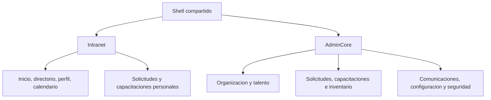

# Frontend y sistema de diseño

> Estado: **vigente** · Verificado: **2026-10-09**
> Evidencia principal: `apps/web/src/app`, `apps/web/src/components`, `apps/web/src/lib`, `apps/web/src/app/globals.css`, `apps/web/next.config.ts`.

## Arquitectura frontend

El frontend usa App Router como estructura de rutas, pero se compila como exportación estática. Los componentes consumen Gaia.Api; no implementan un backend alterno.

Capas prácticas:

- `src/app`: rutas, layouts y composición de pantalla;
- `src/components`: componentes compartidos y componentes de dominio reutilizables;
- `src/lib`: cliente API, acceso por ruta, utilidades y contratos de presentación;
- `src/app/globals.css`: tokens, primitivas visuales y estilos globales;
- `public`: recursos estáticos versionados.

La raíz incorpora proveedores de feedback, seguridad, ambientación visual y control de acceso de rutas.

## Superficies

Intranet prioriza consulta y autoservicio. AdminCore prioriza densidad operativa, edición, bandejas y configuración. Compartir componentes no implica fusionar navegación ni autorización.

Intranet usa `intranet-shell.tsx`; AdminCore usa `app-shell.tsx`. Ambos construyen accesos a partir del catálogo autorizado, pero no reutilizan el menú del otro. El vínculo entre superficies es la aplicación `INT.APP.ADMINCORE`. En Capacitaciones, el menú global muestra un solo acceso y las etapas de edición aparecen dentro de la capacitación.

## Tokens y temas

`globals.css` define colores institucionales verdes y teal, acentos morado/rojo/ámbar, tinta, superficies, líneas, sombras, radios, anchos del sidebar y temas de acento. Existen variantes visuales clásica/renovada y acentos por módulo.

Reglas:

- reutilizar variables existentes antes de introducir valores hexadecimales;
- conservar contraste y estados de foco visibles;
- no usar color como único indicador de estado;
- emplear componentes compartidos para botones, diálogos, feedback y selección;
- mantener responsividad y navegación por teclado.

## Componentes compartidos relevantes

- shell y encabezado de aplicación;
- feedback, notificaciones y diálogos de formulario;
- selector de unidad organizacional;
- selector y avatar de persona;
- enlaces y acciones de documentos;
- vistas y controles de seguridad;
- primitivas bajo `components/ui`;
- ambientación visual.

Antes de crear un componente, se debe buscar una primitiva o patrón existente. Una variante de estilo es preferible a una copia con comportamiento divergente.

## Botones y acciones

- Principal: `gaia-button gaia-button-primary`; una acción dominante por contexto.
- Secundaria: `gaia-button gaia-button-secondary` para editar, gestionar, volver o expandir.
- Peligro: `gaia-button gaia-button-danger`, sólido solo en la confirmación final.
- Icono: mínimo 36 × 36 px, `aria-label`, foco visible y superficie coherente.
- En móvil las acciones envuelven o pasan a columna y nunca amplían el viewport.
- `hover`, `focus-visible`, `active` y `disabled` son obligatorios; hover no es la única señal.

El color principal procede de `--brand-primary`, de modo que respete el tema. No se copian hexadecimales cuando existe token.

## Formularios

- Etiqueta, ayuda, ejemplo, obligatoriedad y error deben mantenerse asociados semánticamente.
- Campos de una misma fila se alinean desde la parte superior aunque sus ayudas tengan distinta longitud.
- Los códigos internos se generan y se ocultan al usuario final.
- El orden se administra por interacción de lista/arrastre; no debe exigirse como dato técnico visible.
- Las opciones visibles se transforman internamente en pares código/etiqueta únicos.
- Para opciones se distinguen presentación (`lista`, `checkbox`, `radio`) y cardinalidad (`única`, `múltiple`); radio siempre es única.
- Un campo técnico restringido, como adjuntos predeterminado, solo expone las propiedades autorizadas.

## Tablas y bandejas

Las tablas deben mostrar información general aplicable al agregado, no asumir campos dinámicos como “Asunto”. Las columnas de estado/plazo y acciones deben conservar alineación y densidad coherentes. Los filtros deben ser acumulables, visibles y preservar la opción “Todas” cuando el alcance funcional la requiere.

Estados, servicios, plazos y búsqueda deben provenir del mismo conjunto consultado; el frontend no debe presentar opciones que el backend no puede evaluar.

Los encabezados usan la regla transversal de tablas AdminCore y no duplican alineaciones locales. Celdas se alinean verticalmente, estados usan texto más color y las acciones se diferencian por jerarquía. En móvil se usa transformación a tarjetas o desplazamiento horizontal controlado.

## Patrones de Intranet

- Inicio, Personas y Calendario permanecen en primer nivel; Mi espacio agrupa aplicaciones, solicitudes y capacitaciones autorizadas.
- Mi espacio se abre como panel accesible, cierra con Escape/clic exterior y devuelve el foco.
- El directorio solo lista datos no sensibles autorizados y soporta nombres/correos largos.
- Inicio distingue carga, error y ausencia; una consulta fallida no se representa como lista vacía.
- Cumpleaños y eventos proceden de datos reales; no se inventan personas, fechas o contadores.
- Conversaciones de solicitudes distinguen visualmente solicitante/equipo sin alterar visibilidad funcional.

`intranet.css` contiene overrides históricos; antes de añadir una regla se revisa la cascada completa. CSS específico de una feature no debe modificar login, footer o AdminCore por accidente.

## Diagramas y diseñadores

Los flujos visuales usan `@xyflow/react` y `dagre`. La numeración mostrada de etapas representa su posición de lectura, no necesariamente el orden de creación persistido. En ramas paralelas, el orden visual se determina de arriba hacia abajo.

La posición visual no reemplaza reglas de activación, unión y transición. El backend valida el grafo al publicar.

## Estados de experiencia

Cada pantalla con datos remotos debe cubrir:

- carga;
- vacío con orientación útil;
- error recuperable;
- falta de sesión;
- falta de permiso;
- éxito de operación;
- confirmación antes de acciones irreversibles.

Los mensajes deben usar lenguaje funcional. Los GUID, nombres lógicos, trazas y códigos técnicos no se muestran como instrucción al usuario.

## Accesibilidad y responsive

- Todos los controles tienen nombre accesible.
- La interacción esencial funciona con teclado.
- El foco vuelve a un lugar predecible al cerrar un diálogo.
- Los modales conservan encabezado y acciones utilizables en pantallas pequeñas.
- Las tablas densas ofrecen adaptación o desplazamiento controlado.
- Texto y controles conservan contraste suficiente en todos los temas.
- Antes de cerrar un cambio visual se revisan escritorio, 768 px, 390 px, zoom, textos largos y temas configurables.
- El movimiento decorativo respeta `prefers-reduced-motion`.

## Acceso por ruta

`route-access.ts` relaciona rutas con permisos para orientar la navegación. Esta relación debe actualizarse cuando se añade una página protegida, junto con la política del endpoint. El control del cliente mejora UX; el control servidor es obligatorio.
