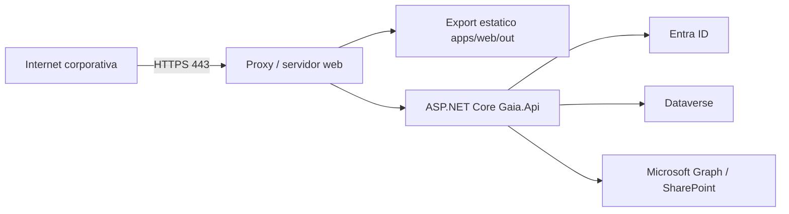

# Instalación, configuración y operación

> Estado: **vigente para desarrollo local** · Verificado: **2026-10-09**
> Evidencia principal: `global.json`, manifiestos de proyecto, `launchSettings.json`, archivos `.example` y configuración de exportación del frontend.
> Limitación: el repositorio no contiene una definición vigente y verificable de la plataforma productiva; las instrucciones de producción se presentan como requisitos, no como una topología ya aprobada.

## Requisitos locales

- Git;
- .NET SDK `10.0.301` o la revisión compatible fijada en `global.json`;
- Node.js compatible con Next.js 16 y pnpm;
- acceso autorizado al tenant de Entra y al entorno Dataverse;
- certificado HTTPS de desarrollo confiable para la API.

No se requiere una base PostgreSQL para la operación actual. La cadena `ConnectionStrings:Gaia` que aún aparece en el archivo de ejemplo es un remanente documental/configurativo y no demuestra una dependencia activa.

## Recuperación del repositorio

```powershell
git clone https://github.com/hackmunar/GestionProyecto.git
Set-Location GestionProyecto
dotnet tool restore
dotnet restore Gaia.Platform.slnx
Set-Location apps\web
pnpm install --frozen-lockfile
Set-Location ..\..
```

## Configuración de la API

Copiar localmente, sin versionar:

```powershell
Copy-Item src\Gaia.Api\appsettings.Development.example.json `
  src\Gaia.Api\appsettings.Development.json
```

Configurar como mínimo:

- `MicrosoftEntra:TenantId` y `ClientId`;
- `Dataverse:EnvironmentUrl`, `WebApiEndpoint` y `Scope`;
- `Authorization:BootstrapAdministrators` solo para el arranque controlado;
- `WebApplication:BaseUrl`;
- configuración SharePoint y alias de credencial, si archivos están habilitados.

Registrar el secreto de Entra con User Secrets:

```powershell
dotnet user-secrets set "MicrosoftEntra:ClientSecret" "VALOR_LOCAL" `
  --project src\Gaia.Api\Gaia.Api.csproj
```

No copiar el valor real a incidencias, Markdown, logs o capturas.

## Configuración del frontend

El valor público esperado es:

```dotenv
NEXT_PUBLIC_GAIA_API_URL=https://localhost:7168
```

Se conserva en `.env.local`, ignorado por Git. Al tener prefijo `NEXT_PUBLIC_`, nunca debe contener secretos.

## Entra ID

La aplicación web de Entra debe incluir los callbacks usados por la API:

- desarrollo: `https://localhost:7168/signin-oidc`;
- cierre: `https://localhost:7168/signout-callback-oidc`;
- ambientes alojados: equivalentes HTTPS del host real.

El `WebApplication:BaseUrl` debe coincidir con el origen real del frontend para CORS y retorno seguro. Los permisos delegados de Dataverse y el consentimiento requerido se configuran en el tenant, no en el navegador.

## Ejecución local

Terminal de API:

```powershell
dotnet run --project src\Gaia.Api\Gaia.Api.csproj --launch-profile https
```

Terminal de frontend:

```powershell
Set-Location apps\web
pnpm dev
```

Direcciones predeterminadas:

- frontend: `http://localhost:3000`;
- API HTTPS: `https://localhost:7168`;
- API HTTP: `http://localhost:5188`;
- salud: `https://localhost:7168/health`.

Solo una instancia puede escuchar cada puerto. `EADDRINUSE` o “address already in use” suele indicar un proceso ya iniciado.

## Comprobaciones operativas

1. `/health` responde satisfactoriamente.
2. `/api/auth/me` devuelve `401` sin sesión y el perfil autorizado después del login.
3. CORS permite únicamente el frontend configurado.
4. La consulta protegida de Dataverse funciona con la identidad delegada.
5. Los diagnósticos de archivo confirman configuración sin revelar secretos.
6. Un usuario sin permiso recibe `403` en la API aunque conozca la URL.

## Construcción

```powershell
dotnet build Gaia.Platform.slnx -c Release -warnaserror
dotnet test Gaia.Platform.slnx -c Release --no-build
Set-Location apps\web
pnpm exec tsc --noEmit
pnpm test
pnpm exec eslint . --max-warnings 0
pnpm build
```

`pnpm build` genera la exportación en `apps/web/out`. La API se publica por separado:

```powershell
dotnet publish src\Gaia.Api\Gaia.Api.csproj -c Release -o publish\api
```

## Requisitos para un despliegue

Antes de publicar en un ambiente real se debe definir y aprobar:

- host de archivos estáticos para `apps/web/out`;
- host de ASP.NET Core y proxy inverso;
- certificados TLS y nombres DNS;
- secretos administrados y rotación;
- orígenes CORS y URL pública;
- registro Entra y callbacks del ambiente;
- solución Dataverse compatible y privilegios;
- sitio/biblioteca SharePoint y consentimiento `Sites.Selected`;
- límites de carga coordinados entre proxy, ASP.NET, Graph y SharePoint;
- observabilidad, respaldo, recuperación y responsables operativos.

El levantamiento histórico sugirió IIS o un proxy Linux, pero no existe evidencia de cuál fue adoptado. Esta topología no debe ejecutarse como receta productiva sin aprobación y revalidación.

### Topología de referencia, no aprobada



Los puertos internos de Kestrel no se exponen directamente. El proxy debe conservar encabezados reenviados, TLS, límites de carga y logs saneados. Frontend y API pueden compartir origen o usar orígenes distintos con CORS exacto y credenciales.

Infraestructura debe suministrar dominios, DNS, certificados, sistema operativo, host/proxy, almacén de secretos, número de instancias, monitoreo, respaldo y recuperación. Se requiere salida HTTPS hacia Entra, Dataverse, Graph y SharePoint autorizados.

Como referencia histórica, un piloto pequeño se estimó inicialmente en 2 vCPU, 4 GB RAM y 20–40 GB de disco; no es dimensionamiento aprobado. Debe medirse CPU, memoria, temporales de cargas, latencia externa y volumen de logs.

### Lista de aceptación

- [ ] DNS y certificados válidos.
- [ ] Frontend estático completo y rutas/base path correctos.
- [ ] `/health` de API monitoreado.
- [ ] Login, callback y logout funcionan por HTTPS.
- [ ] Token delegado y operación Dataverse autorizada funcionan.
- [ ] Usuario sin permiso recibe `403`.
- [ ] CORS/origen único y cookies funcionan en el host real.
- [ ] Configuración SharePoint y prueba controlada de archivo son correctas.
- [ ] Reinicio del servidor recupera frontend/API sin intervención manual.
- [ ] Logs, alertas, rotación y retención están activos.
- [ ] No hay secretos en paquetes, frontend o repositorio.
- [ ] Se probó rollback y recuperación del paquete anterior.

## Copias, recuperación e incidentes

- Git protege código y documentación, no datos de Dataverse ni archivos SharePoint.
- La recuperación de negocio depende de políticas de Microsoft 365/Power Platform del ambiente.
- Los logs deben permitir correlación sin contener tokens, respuestas completas o datos personales innecesarios.
- Ante un fallo de integración, primero se distingue autenticación, autorización Gaia, privilegio Dataverse, configuración Graph y conectividad.
- Las operaciones de mantenimiento o eliminación de datos de prueba requieren permiso específico y ambiente confirmado.

## Apagado local

Finalizar los procesos de desarrollo con `Ctrl+C` en sus terminales. No terminar procesos por nombre de forma indiscriminada en una estación compartida.
