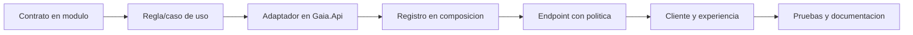

# Desarrollo, pruebas y extensión

> Estado: **vigente** · Verificado: **2026-10-09**
> Evidencia principal: estructura de solución, `Directory.Build.props`, proyectos de pruebas y scripts de `apps/web/package.json`.

## Flujo recomendado

1. Leer [el índice oficial](README.md), la arquitectura y el documento del módulo.
2. Localizar contrato, caso de uso, adaptador, endpoint y pantalla afectados.
3. Confirmar metadatos y permisos antes de cambiar datos o seguridad.
4. Implementar el cambio mínimo dentro del límite del módulo.
5. Añadir pruebas proporcionales.
6. Ejecutar verificaciones focalizadas y luego la suite aplicable.
7. Actualizar Markdown vigente y registrar riesgos.

## Añadir una capacidad a un módulo



El módulo define el lenguaje y la intención. La infraestructura implementa acceso externo. `Program.cs` registra dependencias; no debe contener la lógica de la capacidad.

## Añadir un módulo

- crear proyecto bajo `src/Modules/<Nombre>/Gaia.Modules.<Nombre>`;
- definir contratos y reglas sin depender de `Gaia.Api`;
- incluirlo en `Gaia.Platform.slnx`;
- implementar adaptadores bajo la infraestructura de la API;
- registrar servicios y endpoints en la raíz de composición;
- crear permisos explícitos y políticas;
- añadir rutas frontend solo después de disponer de un contrato seguro;
- documentar alcance, datos, permisos y pruebas.

No se añade un módulo nuevo para evitar reutilizar un contrato ya existente.

## Autorización

Toda nueva operación debe responder:

- ¿requiere solo sesión o un permiso funcional?
- ¿pertenece a Intranet o AdminCore?
- ¿necesita acceso base adicional a la superficie?
- ¿el alcance se restringe al propio usuario o unidad organizacional?
- ¿Dataverse aplica privilegios adicionales?

Las pruebas mínimas cubren usuario no autenticado, usuario sin permiso y usuario autorizado. Para alcances propios u organizacionales se añaden casos fuera de alcance.

## Persistencia

- Definir primero el contrato de dominio.
- Consultar metadatos de Dataverse.
- Mantener OData y nombres lógicos dentro del adaptador.
- No exponer entidades crudas de Dataverse al frontend.
- No introducir PostgreSQL, archivos JSON o memoria como persistencia empresarial alternativa.
- Documentar cualquier nuevo componente de solución.

## Frontend

- reutilizar `api-client`, feedback, shell y primitivas visuales;
- actualizar el mapa de acceso de rutas;
- mantener estados de carga, vacío, error y falta de permiso;
- alinear formularios y conservar accesibilidad;
- evitar cálculos de negocio duplicados;
- probar la composición responsive y no solo el caso de escritorio.

## Pruebas

Backend:

```powershell
dotnet build Gaia.Platform.slnx -c Debug --no-restore -warnaserror
dotnet test Gaia.Platform.slnx -c Debug --no-build --no-restore
```

Frontend:

```powershell
Set-Location apps\web
pnpm exec tsc --noEmit
pnpm test
pnpm exec eslint . --max-warnings 0
pnpm build
```

La cantidad de pruebas no es un indicador permanente de cobertura. Las cifras en actas o documentos antiguos son fotografías fechadas. Para un cambio se informa qué comandos se ejecutaron y su resultado real.

## Calidad esperada

- compilación sin advertencias (`TreatWarningsAsErrors` está activo);
- nulabilidad habilitada;
- análisis .NET en nivel `latest-recommended`;
- errores funcionales controlados;
- sin secretos ni datos reales en fixtures;
- pruebas deterministas y aisladas de ambientes reales salvo pruebas explícitas;
- contratos compatibles o migración documentada.

## Revisión de cambios

Antes de entregar:

- [ ] El cambio permanece en el módulo correcto.
- [ ] Las políticas servidor coinciden con la intención funcional.
- [ ] No se expusieron nombres lógicos ni IDs técnicos al usuario.
- [ ] El alcance organizacional fue probado.
- [ ] Cargas y eliminaciones validan referencias y autorización.
- [ ] No se modificaron archivos de configuración real.
- [ ] Las pruebas relevantes pasaron.
- [ ] La documentación oficial fue actualizada.

## Decisiones arquitectónicas

Una decisión merece ADR cuando cambia tecnología estructural, persistencia, modelo de identidad, límites de módulos, estrategia de archivos o forma de despliegue. Un ADR contiene contexto, decisión, consecuencias y estado. No se reescribe para ocultar historia; se marca reemplazado por otro ADR.

## Continuidad para agentes

El archivo raíz `AGENTS.md` resume la lectura obligatoria y restricciones. No reemplaza esta documentación. Cualquier agente debe inspeccionar el código afectado y conservar cambios del usuario que no pertenezcan a su tarea.
