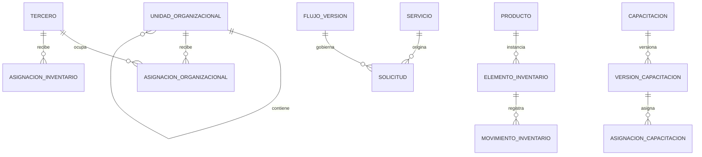
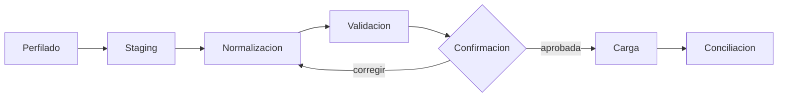

# Modelo funcional, reglas y migración de datos

> Estado: **vigente como marco transversal** · Verificado: **2026-10-09**
> Alcance: reglas comunes; los nombres físicos se confirman en código, manifiestos y metadatos Dataverse.

## Vocabulario

- **Tercero:** persona o sujeto institucional que participa en procesos. No equivale a usuario ni cargo.
- **Asignación organizacional:** posición temporal de una persona dentro de una unidad, con cargo, jefatura y vigencia.
- **Unidad organizacional:** nodo jerárquico institucional.
- **Producto:** definición genérica de un bien.
- **Elemento de inventario:** unidad física identificable.
- **Movimiento:** evento inmutable que cambia o documenta estado, ubicación o responsabilidad.
- **Nivel de control Alta/Baja:** clasificación del producto; no significa baja física.
- **Baja:** proceso formal que retira un elemento.
- **Versión publicada:** definición inmutable utilizada por una instancia histórica.

## Relaciones conceptuales

El diagrama es conceptual: Inventario aún no dispone de adaptador Dataverse operativo y las entidades físicas deben confirmarse antes de implementarlo.

## Principios de modelado

- Las llaves técnicas son distintas de códigos visibles.
- Las relaciones usan IDs, no nombres o descripciones.
- Estados transaccionales usan choices/catálogos, no texto libre.
- Nulo representa ausencia, no “activo”.
- `DateOnly` corresponde a fecha civil; `DateTimeOffset` a instantes.
- Las relaciones con historia conservan inicio/fin y no se sobrescriben.
- Movimientos, respuestas publicadas, actas e historial no se eliminan físicamente.
- Las instantáneas históricas complementan las relaciones: no sustituyen los maestros.
- Datos calculados como nombre completo, nivel o resumen no se convierten en fuente principal sin una estrategia explícita.
- Las reglas críticas viven y se validan en backend.

## Auditoría y privacidad

Según la entidad se conservan creación/modificación, actor, origen, correlación, lote de importación, estado y control de concurrencia. Las operaciones sensibles registran antes/después o un evento funcional suficiente.

Eventos mínimos: creación, actualización, inactivación/reactivación, publicación, aprobación/rechazo, importación, asignación/devolución, generación/anulación documental y eliminación controlada.

No se exponen documentos de identidad, direcciones, contactos o soportes en listados generales. Los logs no contienen datos personales innecesarios, tokens ni archivos. La retención se define antes de automatizar eliminaciones.

## Integridad transversal

- Códigos organizacionales, producto, serial, placa y números de acta aplican unicidad según su alcance confirmado.
- Una unidad no forma ciclos.
- Una asignación vigente no se solapa cuando la regla exige singularidad.
- Una versión publicada no se edita.
- Una acción de negocio se expresa como comando —asignar, devolver, publicar, cerrar— y no como cambio arbitrario de estado.
- ETag o mecanismo equivalente protege actualizaciones sensibles.
- Un borrado comprueba referencias y explica el bloqueo.

## Importación y calidad

### Perfilado

Contar filas, vacíos, duplicados, tipos inconsistentes, valores fuera de catálogo y relaciones rotas. Seriales y códigos se leen como texto.

### Staging

Cada fila conserva archivo/hoja, número, lote, valor original, valor normalizado, advertencias, errores y decisión. El staging no concede validez al dato.

### Normalización

- códigos como texto;
- `0` usado como padre se convierte en ausencia solo bajo regla documentada;
- correos “No tiene”, `PENDIENTE` y `#N/A` se convierten en incidencias, no catálogos;
- se diferencian correo personal/corporativo;
- catálogos comparan mayúsculas, espacios y tildes sin crear duplicados;
- fechas seriales de Excel se interpretan explícitamente.

### Carga y conciliación

El orden respeta dependencias: catálogos, organización, terceros/asignaciones, productos, elementos, ubicaciones, movimientos, asignaciones y documentos. Al finalizar se comparan conteos, duplicados, huérfanos y totales de control.

El informe registra procesados, insertados, actualizados, omitidos, rechazados, advertencias, duplicados y relaciones no resueltas. No se limpian datos directamente en producción, no se transforman ambigüedades silenciosamente y no se crean terceros ficticios.

## Archivos y documentos

Dataverse conserva asociación, nombre original, MIME, tamaño, hash, proveedor, IDs externos, ETag, visibilidad, actor y estado. SharePoint conserva el binario. Las actas y documentos emitidos conservan snapshot y hash cuando corresponda.

Una URL no sustituye identificadores estables. La eliminación lógica pertenece al módulo; la eliminación física pertenece a una operación autorizada con política de retención.

## Cómo añadir datos

1. Definir concepto, propietario, vigencia, estado e invariantes.
2. Comprobar si ya existe tabla/columna equivalente.
3. Consultar metadata y solución del ambiente.
4. Diseñar contrato sin filtrar entidades OData a la UI.
5. Documentar permisos por operación y alcance.
6. Crear componentes de solución de forma idempotente y no destructiva.
7. Implementar adaptador, validación, concurrencia y auditoría.
8. Probar negativos, historia, paginación e importación.
9. Actualizar el documento del módulo y este marco si cambia una regla transversal.
