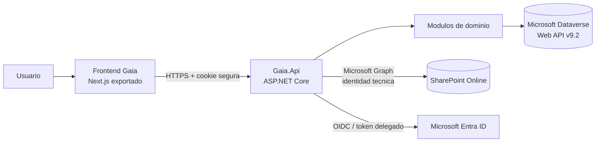

# Documentación oficial de Gaia

> Estado: **vigente**
> Última verificación contra código: **9 de octubre de 2026**
> Alcance: repositorio `Proyecto Gaia Aplicacion`
> Formato oficial: Markdown; los diagramas se mantienen como Mermaid dentro de los `.md`.

Esta es la puerta de entrada única a la documentación técnica y funcional de Gaia. Describe el sistema implementado; no sustituye la revisión del código cuando se modifica una capacidad.

## Cómo usar esta documentación

No es necesario leer todos los capítulos para cada tarea. Empiece siempre por este índice, seleccione un recorrido según su responsabilidad y consulte la [matriz de trazabilidad](10-matriz-trazabilidad.md) para localizar una capacidad concreta.

### Recorrido general

1. [Visión, alcance y arquitectura](01-arquitectura.md)
2. [Identidad, autorización e integraciones Microsoft](02-seguridad-e-integraciones.md)
3. [Módulos funcionales](03-modulos-funcionales.md)
4. [API, persistencia y archivos](04-api-datos-archivos.md)
5. [Frontend y sistema de diseño](05-frontend-diseno.md)
6. [Instalación, configuración y operación](06-instalacion-operacion.md)
7. [Desarrollo, pruebas y extensión](07-desarrollo-extension.md)
8. [Modelo funcional, reglas y migración de datos](09-modelo-funcional-datos.md)
9. [Matriz de trazabilidad técnica y funcional](10-matriz-trazabilidad.md)
10. [Auditoría documental, hallazgos y riesgos](08-auditoria-documental.md)

### Por perfil

| Perfil | Orden mínimo |
|---|---|
| Nuevo desarrollador | Este índice → Arquitectura → Seguridad → Desarrollo → Matriz → módulo afectado |
| Desarrollador frontend | Arquitectura → Frontend/diseño → Seguridad → Matriz → módulo afectado |
| Desarrollador backend | Arquitectura → Seguridad → API/datos → Desarrollo → Matriz → módulo afectado |
| Analista funcional | Módulos funcionales → módulo afectado → Modelo funcional → Matriz |
| Administrador funcional | Seguridad → módulo afectado → Matriz → Auditoría/riesgos |
| Infraestructura/DevOps | Arquitectura → Seguridad/integraciones → Instalación/operación → API/archivos → ADR |
| Seguridad | Seguridad/integraciones → API/archivos → ADR de identidades → Auditoría/riesgos |
| Nueva sesión de Codex | `AGENTS.md` → este índice → Arquitectura → Seguridad → Desarrollo → módulo afectado |

### Por tipo de cambio

| Cambio | Documentos obligatorios |
|---|---|
| Nueva pantalla o ajuste visual | Frontend/diseño, Seguridad, Matriz y módulo |
| Nuevo endpoint u operación | Arquitectura, Seguridad, API/datos, Desarrollo y módulo |
| Nueva tabla/columna Dataverse | API/datos, Modelo funcional, Seguridad y módulo |
| Nuevo permiso o ruta | Seguridad, Frontend/diseño, Matriz y módulo |
| Archivo o integración SharePoint | Seguridad/integraciones, API/archivos, Operación y módulo |
| Despliegue o configuración | Instalación/operación, Seguridad y ADR aplicables |
| Cambio arquitectónico | Arquitectura, Desarrollo, Auditoría y ADR nuevo o reemplazado |

Documentación funcional por módulo:

- [Organización, terceros y perfiles](modulos/organizacion-terceros.md)
- [Inventario](modulos/inventario.md)
- [Comunicaciones y experiencia institucional](modulos/comunicaciones.md)
- [Capacitaciones](modulos/capacitaciones.md)
- [Solicitudes](modulos/solicitudes.md)

Decisiones arquitectónicas:

- [ADR-0001: monolito modular con Dataverse](adr/0001-monolito-modular-dataverse.md)
- [ADR-0002: identidades separadas para usuario, Dataverse y archivos](adr/0002-identidades-separadas.md)

## Mapa del sistema

## Reglas de autoridad

Cuando dos fuentes difieran, se aplica este orden:

1. petición actual y explícita del propietario;
2. decisiones registradas en esta documentación y en los ADR vigentes;
3. código y pruebas actuales para describir comportamiento implementado;
4. documentación vigente del módulo;
5. metadatos y solución aprobada de Dataverse;
6. planes, levantamientos e informes históricos, solo como contexto.

Una contradicción debe registrarse; no autoriza a inferir una nueva arquitectura ni a aplicar silenciosamente un documento antiguo.

## Límites no negociables sin una decisión nueva

- Gaia es un **monolito modular**, con frontend y API como procesos desplegables separados.
- El navegador consume Gaia.Api; no consulta Dataverse ni Microsoft Graph directamente.
- Dataverse es la persistencia empresarial activa.
- Entra ID autentica; la autorización funcional se aplica en la API con permisos Gaia.
- SharePoint almacena archivos mediante un adaptador de backend y una identidad técnica de mínimo privilegio.
- Intranet y AdminCore comparten servicios, pero conservan navegación, experiencia y permisos distintos.
- No se versionan secretos, tokens, datos personales, exportaciones institucionales ni configuraciones reales.

## Alcance de esta base

La documentación heredada fue revisada e integrada en estos capítulos. Los planes y actas que competían como fuentes fueron retirados después de migrar sus reglas vigentes. El historial de Git conserva su contenido anterior; la fuente de trabajo es exclusivamente esta estructura.

## Mantenimiento

Todo cambio de arquitectura, seguridad, persistencia, rutas públicas, permisos, tablas o límites de módulo debe:

1. actualizar el documento temático correspondiente;
2. añadir o reemplazar un ADR si cambia una decisión;
3. registrar evidencia verificable y fecha;
4. actualizar la matriz de trazabilidad y la auditoría cuando cambie el estado;
5. mantener secretos y valores ambientales fuera de Markdown.
