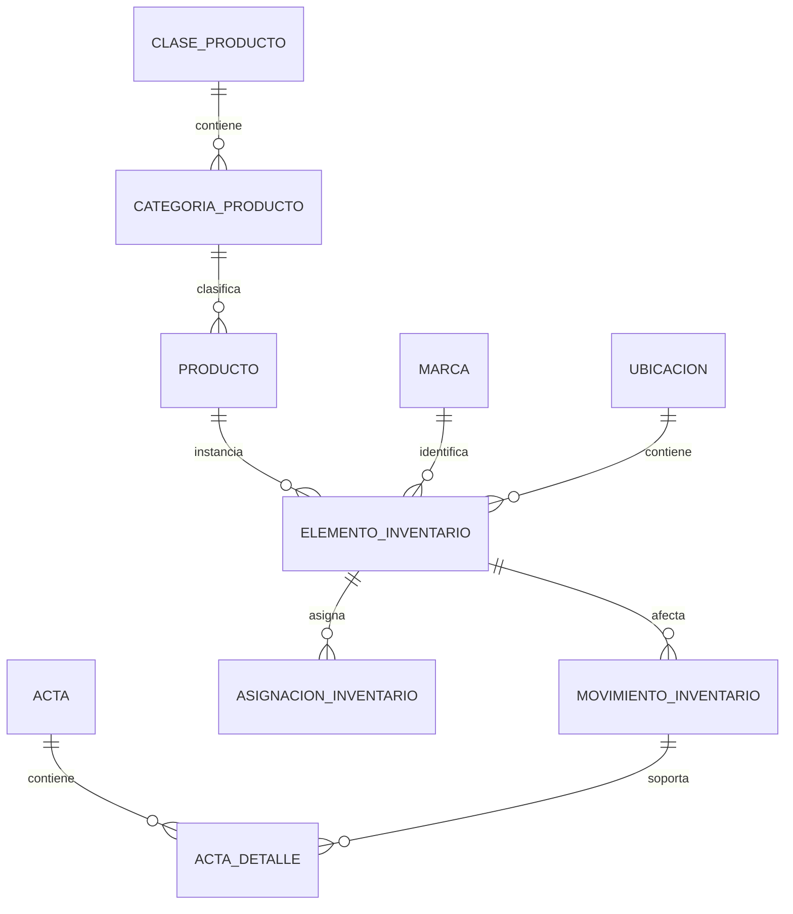

# Inventario

> Estado: **no disponible operativamente** · Verificado: **2026-10-09**
> Evidencia: `InventoryEndpoints.MapUnavailable` responde `503` porque no existe adaptador Dataverse operativo.

## Estado real

El proyecto registra `Gaia.Modules.Inventory`, permisos `inventory.read` y `inventory.manage`, pero todas las rutas `/api/inventory/{**path}` informan que el módulo todavía no cuenta con implementación Dataverse. Las reglas siguientes preservan el modelo funcional levantado; no describen una capacidad ya disponible.

## Modelo objetivo

Un producto define un tipo de bien; un elemento representa una unidad física. Clase, categoría y producto no se duplican en cada elemento. Ubicación física, responsable y unidad receptora son conceptos diferentes.

## Reglas preservadas

- Serial y placa son únicos cuando existen y el producto los exige.
- `Alta/Baja` del catálogo es un nivel de control, no el estado ni el proceso de baja del elemento.
- Estado operativo distingue disponible, asignado, mantenimiento, baja, perdido u otros aprobados.
- Todo cambio relevante de responsable, ubicación o estado genera un movimiento.
- Los movimientos confirmados son inmutables; se corrigen mediante compensación o anulación auditada.
- Solo existe una asignación activa por elemento no consumible.
- No se asigna un elemento inactivo, dado de baja, perdido o en mantenimiento.
- Una entrega registra receptor, fecha, ubicación, condición y soporte.
- Una devolución cierra la asignación y determina el destino.
- Un traslado no puede tener origen y destino iguales.
- La baja formal requiere motivo, autorización y soporte.
- Una acta emitida conserva instantáneas de persona, cargo, unidad y elemento; no cambia al editar maestros.
- Una acta aceptada no se edita: se anula y reemplaza mediante proceso auditado.

## Movimientos esperados

Ingreso, entrega/asignación, devolución, traslado, préstamo, retorno, envío/retorno de mantenimiento, ajuste autorizado, pérdida, hurto, daño y baja definitiva. El catálogo real debe aprobarse antes de crear metadatos.

## Información mínima

Producto: código, clase, categoría, nombre, reglas de serial/placa, consumo y estado. Elemento: producto, marca, modelo, serial, placa, fechas, conservación, estado operativo, ubicación, centro de costo, financiador, valor, garantía y observaciones. Movimiento: tipo, fecha efectiva, origen/destino, responsables, motivo, actor, aprobación, soporte e ID de operación.

## Reportes objetivo

- inventario por estado, clase, categoría, producto y marca;
- elementos por persona, unidad y ubicación;
- disponibles, en mantenimiento y bajas;
- elementos sin serial requerido o asignaciones sin acta;
- historia completa y conciliación elemento/asignación.

## Condición para implementación

Antes de habilitar endpoints se deben confirmar tablas, choices, relaciones y permisos del Dataverse objetivo; implementar contratos y adaptadores; importar mediante staging; probar concurrencia y reglas; y sustituir explícitamente `MapUnavailable`. No debe construirse una base paralela.
