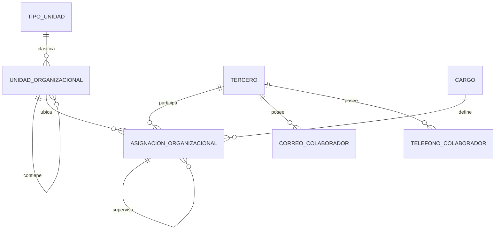

# Organización, terceros y perfiles

> Estado: **parcialmente implementado** · Verificado: **2026-10-09**
> Código principal: `Gaia.Modules.Organization`, `Gaia.Modules.ThirdParties` y sus adaptadores Dataverse.

## Responsabilidades

Organization administra tipos de unidad, sedes, unidades y cargos. ThirdParties administra la identidad de personas, contactos, asignaciones organizacionales, directorio, perfil y fotografías. Ambos módulos comparten estructura, pero no deben confundir persona, vinculación, cargo, asignación y rol de seguridad.

## Modelo conceptual

La implementación vigente trabaja con `gaia_organizacion`, `gaia_cargo`, `gaia_sede`, `gaia_asignacionorganizacional`, `gaia_terceros`, `gaia_correocolaborador` y `gaia_telefonocolaborador`. Los nombres exactos de relaciones y atributos siempre se resuelven por metadatos.

## Reglas organizacionales

- El código organizacional es texto y no reemplaza la llave técnica.
- Una unidad puede tener cero o un padre y nunca puede ser su propio padre.
- La jerarquía no admite ciclos y debe soportar profundidad variable.
- El nivel se deriva de la jerarquía; si se persiste, debe sincronizarse.
- Una unidad referenciada no se elimina físicamente.
- Cambiar el padre requiere auditoría y no reescribe historia.
- Una unidad inactiva continúa disponible para consultas históricas y no recibe nuevas asignaciones salvo excepción autorizada.
- El organigrama se construye desde datos, no desde HTML fijo.

La API implementa lectura y mantenimiento de tipos de unidad, sedes, unidades y cargos bajo `/api/organization`, con permisos separados `ORG.*`.

## Personas y asignaciones

- La identidad de la persona no depende de su cargo, unidad o rol de seguridad.
- Una persona puede conservar varias asignaciones históricas.
- Cargo, unidad, jefe y vigencia pertenecen a la asignación organizacional.
- Debe existir como máximo una asignación principal vigente, salvo excepción funcional aprobada.
- La jefatura referencia una asignación válida, no un nombre libre.
- Los cambios no sobrescriben periodos anteriores.
- Cerrar una vinculación exige revisar asignaciones, accesos, inventarios y procesos pendientes.
- Datos personales, documentos y contactos requieren permisos específicos.

ThirdParties implementa actualmente:

- listado, creación y actualización básica de terceros;
- tipos de documento;
- correos y teléfonos;
- asignaciones organizacionales;
- validación y ejecución de importaciones administrativas;
- directorio de Intranet, unidades para filtro y cumpleaños;
- perfil del usuario autenticado y fotografías.

Idiomas, estudios, formaciones, experiencias, contactos de emergencia y algunos endpoints de importación heredados responden `503 Funcionalidad en transición`; no deben presentarse como capacidades terminadas.

## Directorio y perfil

El directorio permite búsqueda por persona y filtro jerárquico de unidad con paginación. Los DTO de listado solo exponen información autorizada. `/api/profile/` resuelve el tercero asociado a la sesión; no acepta un ID arbitrario. El perfil muestra únicamente los datos disponibles y no inventa valores faltantes.

### Fotografías institucionales

Las fotografías se consultan desde la API con token delegado de Graph:

- `/api/profile/photo?size=...` para la identidad actual;
- `/api/intranet/people/{personId}/photo?size=...` para directorio autorizado;
- tamaños permitidos: 48, 64, 96, 120 y 240 píxeles;
- `404` significa ausencia de foto; `401/403` falta de sesión/permiso; `503` indisponibilidad controlada de Graph;
- respuestas positivas se almacenan temporalmente en memoria y las ausencias por un periodo menor;
- el frontend usa `PersonAvatar`, carga diferida, concurrencia acotada e iniciales como fallback.

Resolución de identidad, en orden:

1. Object ID de Entra en el tercero cuando existe;
2. usuario de aplicación activo relacionado con el tercero;
3. correo corporativo como compatibilidad temporal.

Nunca se usa el nombre ni el GUID de tercero como si fuera automáticamente el Object ID de Entra. El permiso delegado mínimo documentado para fotografías es `ProfilePhoto.Read.All`, sujeto a consentimiento del tenant.

## Importaciones

Las importaciones administrativas separan validación y ejecución. Deben conservar origen, fila, lote, valores originales, normalización, advertencias y decisión. No se insertan filas ambiguas directamente en producción.

## Seguridad y alcance

Los endpoints aplican permisos de Organización, Talento Humano o Intranet según superficie. Los listados generales no exponen documentos, direcciones o contactos personales sin permiso.

Una operación limitada por unidad debe comprobar las asignaciones vigentes de la persona en el backend. La pertenencia enviada por el navegador no es evidencia suficiente.

## Pendientes confirmados

- Completar adaptadores Dataverse de las operaciones que hoy devuelven `503`.
- Validar en el ambiente la columna estable para Object ID de Entra antes de depender de ella.
- Definir política de cierre de vinculación e integración con inventarios/solicitudes.
- Probar importaciones con datos representativos, duplicados y relaciones rotas.
