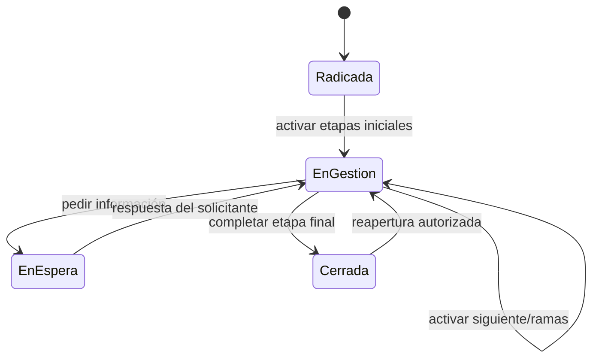

# Solicitudes

> Estado: **implementado; no declarado listo para producción** · Verificado: **2026-10-09**
> Código principal: `Gaia.Modules.Solicitudes`, adaptadores `Infrastructure/Dataverse/Solicitudes`, infraestructura de archivos y features de Solicitudes.

## Superficies

- Intranet: `/intranet/solicitudes`, catálogo, radicación, bandeja personal, expediente y respuesta.
- AdminCore: `/solicitudes`, bandejas y gestión.
- Configuración: `/solicitudes/servicios-y-flujos` y rutas relacionadas.
- API: `/api/solicitudes`.

## Configuración

Un servicio pertenece a una unidad y define visibilidad, vigencia, plazo y responsable predeterminado. Los formularios de radicación y flujos son versionados. Publicar fija una versión; editar requiere borrador o nueva versión según su estado.

El diseñador de flujo soporta:

- etapas iniciales, finales y de reapertura;
- asignación por unidad, persona o responsable de la solicitud;
- activación por cualquier conexión o por todas;
- ramas lineales, paralelas y convergencia;
- rutas por completado, aprobado, rechazado, devuelto, requiere aprobación o no aplica;
- observación, devolución, archivo y decisión;
- formularios dinámicos propios por etapa.

Los códigos técnicos de servicios, campos y opciones se generan internamente. El orden se deriva de la posición configurada, no se exige al usuario como dato manual.

## Radicación

El solicitante selecciona un servicio visible, recibe su formulario publicado, confirma y radica. La solicitud nace en estado Radicada, conserva la versión publicada y congela los días hábiles aplicables. Cambios futuros del servicio no recalculan solicitudes existentes.

Los formularios dinámicos muestran etiqueta, ayuda, ejemplo, tipo, presentación, obligatoriedad y visibilidad. Los adjuntos configurables controlan el mismo cargador existente; no existe un sistema paralelo.

## Ejecución del flujo

Al radicar se crea la instancia del flujo y las gestiones iniciales. Completar una gestión activa únicamente rutas compatibles. Una convergencia “todas” espera todas las entradas; “cualquiera” activa con la primera compatible. La etapa final cierra cuando no queda trabajo pendiente y conserva el resumen de solución.

Una reejecución crea otra gestión y no sobrescribe respuestas anteriores. Pedir información relaciona comentario y gestión; la respuesta del solicitante reanuda esa misma gestión. Reabrir conserva versión e historia y crea la ejecución prevista.

## Formularios de etapa

Administración:

- `GET/PUT /administration/workflow-steps/{stepId}/form`;
- `POST/PUT/DELETE .../form/fields`.

Ejecución:

- `GET /management/workflows/{managementId}/form`;
- `PUT /management/workflows/{managementId}/form/responses`.

Se guardan respuestas tipadas, después archivos de campo y finalmente el resultado. El servidor rechaza campos ajenos/ocultos, opciones de otro campo, valores inválidos y archivos no asociados a la misma solicitud/gestión. La finalización vuelve a comprobar obligatoriedad y archivos. Los valores de formulario no activan rutas directamente; el motor usa el resultado autorizado de la gestión.

## Bandejas y alcance

La operación usa una sola vista general adaptada por permisos:

- Mis pendientes: asignadas a la persona o disponibles sin responsable en **su propia unidad organizacional**.
- Mi unidad: trabajo de unidades autorizadas.
- Aprobaciones: etapas que requieren decisión.
- Esperando respuesta: gestiones suspendidas por información del solicitante.
- En gestión, cerradas y todas según estado.

Las bandejas consideran terminal una solicitud cuando el estado está marcado como final o su código es `CERRADA`/`RESUELTA`; así una inconsistencia histórica del indicador `gaia_EsFinal` no devuelve solicitudes cerradas a “En gestión”. En el expediente, los formularios de etapas finalizadas se presentan por fecha real de finalización, con fecha de disponibilidad y número de ejecución únicamente como desempates estables.

La bandeja operativa no expone acciones para eliminar o retirar solicitudes, sin importar su estado. La vista **Cerradas** agrega una columna **Constancia** que obtiene el detalle y el recorrido de la solicitud en segundo plano y descarga directamente el PDF institucional, sin abrir previamente el expediente. El cambio de responsable general solo aparece en **Mis pendientes**, **Esperando respuesta** y **En gestión**; se oculta en **Cerradas** y **Todas**. Esta acción actualiza la responsabilidad general de la solicitud, mientras que la reasignación de una etapa activa se realiza desde el expediente mediante **Reasignar etapa**.

La bandeja pagina y filtra en Dataverse mediante `@odata.nextLink`; no usa `$skip`. Búsqueda, servicio, estado, plazo y orden forman la consulta. Las gestiones vencidas y fechas próximas tienen prioridad.

El rol puede tener `gaia_administracionglobal`; esta propiedad amplía alcance organizacional solo junto con el permiso funcional correspondiente. No se deduce del nombre del rol. Los roles departamentales permanecen restringidos a sus unidades.

## Expediente operativo

Una persona autorizada ve:

1. gestión actual: etapa, instrucciones, plazo, requisitos, formulario y decisiones;
2. solicitud: número, servicio, solicitante y respuestas del formulario inicial;
3. recorrido: etapas, unidad, responsable, resultado, observación, fechas, respuestas y archivos;
4. próximos destinos explicados sin códigos técnicos;
5. conversación, notas internas, historial y adjuntos.

El recorrido gráfico de la solicitud reutiliza la misma representación de solo lectura en AdminCore e Intranet. Ocupa el ancho disponible del expediente, conserva las ramas según la posición publicada y diferencia mediante texto y color las etapas completadas, actuales y pendientes; en pantallas estrechas ofrece desplazamiento horizontal controlado. En la Intranet, el modal se abre inmediatamente con un estado de carga mientras detalle, recorrido y archivos se consultan en paralelo; después muestra las gestiones finalizadas en orden cronológico con la decisión, fecha, área, responsable y observación disponibles en el contrato autorizado. Los archivos mantienen la misma jerarquía visual de AdminCore e identifican si pertenecen a la solicitud o a una gestión.

Etapas anteriores son de solo lectura. Solo la gestión activa autorizada se modifica. El historial distingue información interna de visible para el solicitante.

La constancia PDF de una solicitud cerrada es un documento institucional: usa el logotipo y la identidad visual de Gaia, presenta el resumen de la solicitud, el resultado de cierre, las gestiones de etapa en orden cronológico y la conversación visible para el solicitante. Cada gestión identifica etapa, decisión, fecha, unidad, responsable, observación y respuestas de su formulario cuando el contrato autorizado las entrega. Las notas internas se excluyen porque la constancia puede compartirse fuera del equipo de gestión; el documento pagina automáticamente y repite encabezado y pie institucional. En **Mis solicitudes** de la Intranet, las filas cerradas o resueltas muestran junto a **Ver** un acceso directo a esta constancia; el detalle y el recorrido se consultan en segundo plano sin abrir el modal.

## SLA y reasignación

Cada gestión puede tener meta en días hábiles. La fecha objetivo excluye fines de semana y días no laborables activos. Se conservan lectura histórica, transcurrido, restante y vencimiento.

Reasignar una etapa requiere permiso, motivo y pertenencia vigente a la unidad de la etapa. Puede asignarse a una persona o volver a la bandeja de unidad sin cambiar el responsable general. El backend valida la pertenencia y registra la trazabilidad.

## Adjuntos

- metadatos y asociaciones en Dataverse; binario en SharePoint;
- cargas múltiples secuenciales;
- una radicación puede quedar creada si un adjunto falla, informando resultado parcial;
- carga de gestión autorizada al responsable o miembro habilitado de la unidad;
- inactivación lógica y eliminación física solo mediante política explícita;
- conciliación reporta faltantes/huérfanos sin borrarlos automáticamente;
- historial registra actor, origen, visibilidad, fecha e ID de operación.

## Seguridad

- portal: `INT.SOLICITUDES.VER`;
- bandeja: `HD.SOLICITUDES.VER`;
- reasignación: `HD.SOLICITUDES.REASIGNAR`;
- catálogos: `HD.CATALOGOS.VER` y `HD.CATALOGOS.ADMINISTRAR`;
- eliminación de datos de prueba: permiso específico.

El portal no concede administración. Toda toma, respuesta, transición, archivo y reasignación se reautoriza en API.

## Integridad y producción

El motor usa IDs de operación, claves alternativas, ETag y ChangeSets para evitar duplicados y confirmar de forma atómica activaciones, devoluciones y cierre. Antes de producción siguen siendo obligatorias pruebas reales de concurrencia/colisión en un Dataverse aislado, verificación visual autenticada y recorridos con identidades de varias unidades.
